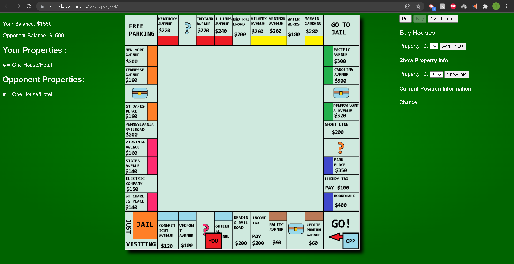

# Monopoly-AI
> Play against an AI Monopoly Player Online

### What it Does 💡: 
- Users play against an AI monopoly player in real time.
- AI player is implemented using three levels/strategies (only one is deployed on the site)
  - Monte Carlo (main): Uses monte carlo tree search to simulate future outcomes and selects decision with highest chance of success
  - Markov Chains: Calculates probability of landing on every possible property via Markov Chain steady states and buys properties with best expected value
  - Basic Human: Probability of buying a property is a linear function of how close it is to Boardwalk, similar to how regular people play.

### How it Was Built 🔎:
- Frontend built using Javascript/CSS/HTML, animations and designs from scratch
- Backend powered using Django, which communicates with player via REST API
- Player Strategies implemented in Python

Preview:

##### Files Overview:
- **backend/simulate.py**: Implementation of AI player and randomized player that simulate X games against each other
- **backend/player.py**: Implementation of AI player that plays against humans via REST API
- **"app.js"**: Contains front-end game mechanics, design and animations. 
- **"index.html/style.css"**: Contains base HTML/CSS code, nothing special
- **log.txt**: Update logs of the AI player playing against a randomized player. Describes the moves each of them makes until one wins
- **you.png/opp.png/board.png/thumbnail**: Game image files
